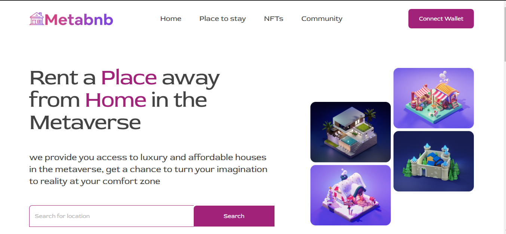

# meta-bnb
This is a website that provide you access to luxury and affordable houses in the metaverse, get a chance to turn your imagination to reality at your comfort zone Search for location Search.


My goal here is to Build a single page web application for metaverse using the React library, Click [here](https://metaverse-bnb.netlify.app/) to get a live preview of the project.

## Built With
- React
- TailwindCSS

### Prerequisites
The basic requirements for building the executable are:

- A working browser application (Google chrome, Mozilla Fire fox, Microsoft edge ...)
- VSCode or any other equivalent code editor
- Node Package Manager (For installing packages like Lighthous, webhint & stylelint used for checking for debugging bad codes before deployment)

# Getting Started

#### Cloning the project

```
git clone  https://github.com/vickymarz/meta-bnb.git <Your-Build-Directory>
```
## Getting packages and dependencies
To get all package modules required to build the project run:
```
npm install
```
every package module required to build the project is listed in the package.json file. this is used as a reference to get all dependencies.

## Running

To run the program on a browser through a server run this command in your cli
```
npm start
```
This should open the page in your localhost on port 3000. then you'd be able to view the built page generated using webpack.

## Building

To build the project run:
```
npm run build
```
after you run this sucessfully you'd locate the build from in the ```build``` folder located from the parent directory of the project.

## 🤝 Contributing

Feel free to check the [issues page](../../issues/).

## Author

👤 **Victor Okoroji**

- GitHub: [@githubhandle](https://github.com/vickymarz)
- Twitter: [@twitterhandle](https://twitter.com/Vicky_marz)
- LinkedIn: [LinkedIn](https://www.linkedin.com/in/victorebubeokoroji/)

## Show your support

Give a ⭐️ if you like this project!

## Acknowledgments

- HNG
- Zuri

## 📝 License

This project is [MIT](./MIT.md) licensed.
